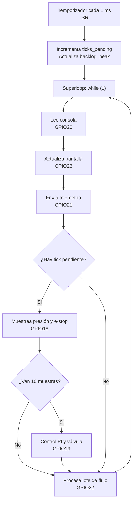

# RET — Timing Evidence Report

**Team:** `<Mariana Zuluaga Yepes>` · **Boards:** `<ESP32-C6 and STM32L476>`

## 1. The system and its task set

Requirements first — one sentence each, EARS style (*when/while `<condition>`, the
system shall `<response>` within `<deadline>`*) — then the task that implements them:

| ID | Requirement |
|---|---|
| REQ-CTRL-01 | While the system is irrigating, the control loop shall run every 10 ms (deadline = period). |

| Task | Req. | Type (H/F/S) | Period | Deadline | Measured C_i | How it was measured |
|---|---|---|---|---|---|---|
| Control loop | REQ-CTRL-01 | Hard | 10 ms | = T | ____ | <GPIO + analyzer / trace> |

# Lab 2 — Diagrama del superloop

## Lectura del flujo

- El temporizador solo registra que pasó 1 ms.
- El superloop revisa las tareas en un orden fijo.
- Cada 10 muestreos se ejecuta el control de la válvula.
- El comando `calib` bloquea el superloop; por ello se acumulan ticks pendientes.

## 2. ADRs

### ADR-001 — `<title>`
**Context:** … · **Decision:** … · **Justification (with numbers):** … · **Status:** …

## 3. Evidence by week

Each entry cites the `REQ`(s) it verifies.

### Week 2 — superloop baseline (state the board)
<jitter/latency table + a one-sentence reading>

### Week 3 — S3 baseline and silicon comparison
…

## 4. Schedulability analysis

U = ΣC_i/T_i with **measured** C_i; test used (RM / hyperbolic / EDF); RTA as a
script with its output; blocking B_i if there are mutexes. (Formulas: READINGS.md,
"The math that does get used".)

## 5. Functional safety (final project)

Declared safe state (failure ⇒ valve closed), watchdog, and the evidence of the
fail-safe firing.

