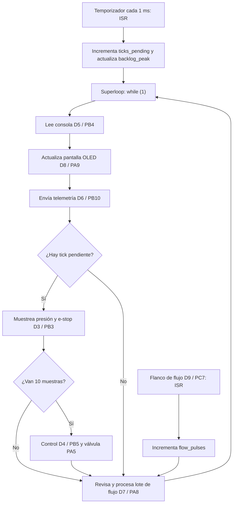

# RET — Timing Evidence Report

**Grupo:** `Mariana Zuluaga Yepes` `María Prieto Ortega` `Rafael Torres Choperena`  ·  **Placa:** `Nucleo-L476RG`

## 1. El sistema y su conjunto de tareas

| ID | Requisito |
|---|---|
| REQ-SAMP-01 | Mientras el sistema está activo, deberá ejecutar el muestreo de presión y e-stop cada 1 ms, dentro de un plazo de 1 ms. |
| REQ-CTRL-01 | Mientras el sistema está irrigando, deberá ejecutar el control cada 10 ms, dentro de un plazo de 10 ms. |
| REQ-TEL-01 | Mientras el sistema está activo, deberá publicar telemetría cada 1 s. |
| REQ-HMI-01 | Mientras la HMI está habilitada, deberá actualizar la pantalla cada 500 ms. |
| REQ-FLOW-01 | Cuando se acumulen 100 pulsos de flujo, deberá procesar el lote en la siguiente iteración disponible del superloop. |

| Tarea | Req. | Tipo | Período / activación | Fecha límite | `C_i` observado | Método |
|---|---|---|---|---|---:|---|
| Muestreo | REQ-SAMP-01 | Duro | 1 ms | 1 ms | 5 µs | Ancho de pulso D3, Logic 2 |
| Control | REQ-CTRL-01 | Duro | 10 ms | 10 ms | 2.5 µs | Ancho de pulso D4, Logic 2 |
| Consola (`help`) | — | Firme | Por evento | No definida | 1.313 ms | Ancho de pulso D5, Logic 2 |
| Telemetría | REQ-TEL-01 | Suave | 1 s | 1 s | 6.1555 ms | Ancho de pulso D6, Logic 2 |
| Lote de flujo | REQ-FLOW-01 | Firme | Cada 100 pulsos | No definida | 70.5 µs | Ancho de pulso D7, Logic 2 |
| Pantalla OLED | REQ-HMI-01 | Suave | 500 ms | 500 ms | 25.06 ms | Ancho de pulso D8, Logic 2 |

## Diagrama del superloop — Lab 2, tarea A

```mermaid
flowchart TD
    T["Temporizador cada 1 ms: ISR"] --> P["Incrementa ticks_pending y actualiza backlog_peak"]
    F["Flanco de flujo D9 / PC7: ISR"] --> Q["Incrementa flow_pulses"]

    P --> L["Superloop: while (1)"]

    L --> C["Lee consola D5 / PB4"]
    C --> H["Actualiza pantalla OLED D8 / PA9"]
    H --> E["Envía telemetría D6 / PB10"]
    E --> D{"¿Hay tick pendiente?"}

    D -- Sí --> S["Muestrea presión y e-stop D3 / PB3"]
    S --> K{"¿Van 10 muestras?"}
    K -- Sí --> R["Control D4 / PB5 y válvula PA5"]
    K -- No --> B["Revisa y procesa lote de flujo D7 / PA8"]
    R --> B
    D -- No --> B

    Q --> B
    B --> L
```

## Lectura del flujo

- El temporizador genera una interrupción cada 1 ms. La ISR no ejecuta el muestreo: incrementa `ticks_pending` y actualiza `backlog_peak` si se acumulan ticks.

- El superloop recorre siempre el mismo orden: consola, pantalla OLED y telemetría. Después revisa si hay un tick de muestreo pendiente.

- Si existe un tick pendiente, ejecuta el muestreo de presión y e-stop en D3. Cada diez muestras ejecuta además el control en D4 y actualiza la válvula en PA5.

- La entrada de flujo llega por D9/PC7. Su ISR incrementa `flow_pulses`; el superloop revisa ese contador en la tarea de lote de flujo, instrumentada en D7.

- La tarea de flujo se revisa en cada vuelta del ciclo. Cuando no hay tick pendiente, el superloop pasa directamente desde la telemetría hacia la revisión de flujo.

- Como todas las tareas comparten un solo `while (1)`, una tarea lenta bloquea temporalmente a las demás. La actualización de OLED y el comando `calib` pueden retrasar el muestreo y acumular `ticks_pending`.

## 2. ADRs

### ADR-001 — `<title>`
**Context:** … · **Decision:** … · **Justification (with numbers):** … · **Status:** …

## 3. Evidencia por semana

Each entry cites the `REQ`(s) it verifies.

### Semana 2 — línea base del superloop

**Placa:** Nucleo-L476RG  
**Instrumento:** Logic 2  
**Señales:** D3 muestreo, D4 control, D5 consola, D6 telemetría,
D7 lote de flujo, D8 OLED y D9 entrada de flujo.

| REQ(s) | Condición | Medición | Resultado | 
|---|---|---|---:|---|
| REQ-SAMP-01 | OLED + caché | Frecuencia media de D3 | 1.001 kHz |
| REQ-SAMP-01 | OLED + caché | Período máximo de D3 | 23.87 ms |
| REQ-SAMP-01 | OLED + caché | Desviación estándar | 1.062 ms |
| REQ-SAMP-01, REQ-HMI-01 | OLED + `nocache.conf` | Frecuencia media de D3 | 1.002 kHz |
| REQ-SAMP-01, REQ-HMI-01 | OLED + `nocache.conf` | Período máximo de D3 | 25.58 ms |
| REQ-SAMP-01, REQ-HMI-01 | OLED + `nocache.conf` | Jitter tardío máximo | 24.58 ms |
| REQ-SAMP-01, REQ-HMI-01 | OLED + `nocache.conf` | `backlog_peak` normal | 30 ticks |
| REQ-FLOW-01 | D3 conectado a D9 | Latencia D9 → D7 | 12.5 µs |
| REQ-FLOW-01 | D3 conectado a D9 | `C_i` de lote de flujo en D7 | 70.5 µs | 
| REQ-SAMP-01, REQ-CTRL-01 | Comando `calib` | Duración de `calib` en D5 | 408.882 ms | 
| REQ-SAMP-01 | Comando `calib` | Mayor período de D3 | 432.332 ms | 
| REQ-SAMP-01 | Comando `calib` | Jitter tardío | 431.332 ms | 
| REQ-SAMP-01 | Comando `calib` | `backlog_peak` | 432 ticks | 

La frecuencia media se mantuvo cercana a 1 kHz, pero la actualización de la OLED produjo huecos de hasta 25.58 ms en D3. El comando `calib` bloqueó el único superloop durante 408.882 ms, acumuló 432 ticks y retrasó tanto el muestreo como el control.

### Week 2 — superloop baseline (state the board)
<jitter/latency table + a one-sentence reading>

### Week 3 — S3 baseline and silicon comparison
…

## 4. Schedulability analysis

U = ΣC_i/T_i with **measured** C_i; test used (RM / hyperbolic / EDF); RTA as a
script with its output; blocking B_i if there are mutexes. (Formulas: READINGS.md,
"The math that does get used".)

## 5. Functional safety (final project)

Declared safe state (failure ⇒ valve closed), watchdog, and the evidence of the
fail-safe firing.

