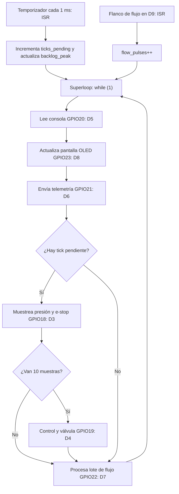

# RET — Timing Evidence Report

**Grupo:** `<Mariana Zuluaga Yepes>`  `<María de los Angeles Prieto Ortega>`      ·       **Placa:** `<Nucleo-L476RG>`

## 1. El sistema y su conjunto de tareas

| ID | Requisito |
|---|---|
| REQ-SAMP-01 | Mientras el sistema está activo, deberá ejecutar el muestreo de presión y e-stop cada 1 ms, dentro de un plazo de 1 ms. |
| REQ-CTRL-01 | Mientras el sistema está irrigando, deberá ejecutar el control cada 10 ms, dentro de un plazo de 10 ms. |
| REQ-TEL-01 | Mientras el sistema está activo, deberá publicar telemetría cada 1 s. |
| REQ-HMI-01 | Mientras la HMI está habilitada, deberá actualizar la pantalla cada 500 ms. |
| REQ-FLOW-01 | Cuando se acumulen 100 pulsos de flujo, deberá procesar el lote en la siguiente iteración disponible del superloop. |

| Tarea | Req. | Tipo | Período / activación | Fecha límite | `C_i` observado | Método |
|---|---|---|---|---|---:|---|
| Muestreo | REQ-SAMP-01 | Duro | 1 ms | 1 ms | 5 µs | Ancho de pulso D3, Logic 2 |
| Control | REQ-CTRL-01 | Duro | 10 ms | 10 ms | 2.5 µs | Ancho de pulso D4, Logic 2 |
| Consola (`help`) | — | Firme | Por evento | No definida | 1.313 ms | Ancho de pulso D5, Logic 2 |
| Telemetría | REQ-TEL-01 | Suave | 1 s | 1 s | 6.1555 ms | Ancho de pulso D6, Logic 2 |
| Lote de flujo | REQ-FLOW-01 | Firme | Cada 100 pulsos | No definida | 70.5 µs | Ancho de pulso D7, Logic 2 |
| Pantalla OLED | REQ-HMI-01 | Suave | 500 ms | 500 ms | 25.06 ms | Ancho de pulso D8, Logic 2 |

## Diagrama del superloop — Lab 2, tarea A

```mermaid
flowchart TD
    T["Temporizador cada 1 ms: ISR"] --> P["Incrementa ticks_pending y actualiza backlog_peak"]
    F["Flanco de flujo en D9: ISR"] --> Q["flow_pulses++"]
    P --> L["Superloop: while (1)"]
    Q --> L

    L --> C["Lee consola GPIO20: D5"]
    C --> H["Actualiza pantalla OLED GPIO23: D8"]
    H --> E["Envía telemetría GPIO21: D6"]
    E --> D{"¿Hay tick pendiente?"}

    D -- Sí --> S["Muestrea presión y e-stop GPIO18: D3"]
    S --> K{"¿Van 10 muestras?"}
    K -- Sí --> R["Control y válvula GPIO19: D4"]
    K -- No --> B["Procesa lote de flujo GPIO22: D7"]
    R --> B
    D -- No --> B
    B --> L
```

## Lectura del flujo

- El temporizador solo registra que pasó 1 ms.
- El superloop revisa las tareas en un orden fijo.
- Cada 10 muestreos se ejecuta el control de la válvula.
- El comando `calib` bloquea el superloop; por ello se acumulan ticks pendientes.

## 2. ADRs

### ADR-001 — `<title>`
**Context:** … · **Decision:** … · **Justification (with numbers):** … · **Status:** …

## 3. Evidence by week

Each entry cites the `REQ`(s) it verifies.

### Week 2 — superloop baseline (state the board)
<jitter/latency table + a one-sentence reading>

### Week 3 — S3 baseline and silicon comparison
…

## 4. Schedulability analysis

U = ΣC_i/T_i with **measured** C_i; test used (RM / hyperbolic / EDF); RTA as a
script with its output; blocking B_i if there are mutexes. (Formulas: READINGS.md,
"The math that does get used".)

## 5. Functional safety (final project)

Declared safe state (failure ⇒ valve closed), watchdog, and the evidence of the
fail-safe firing.

